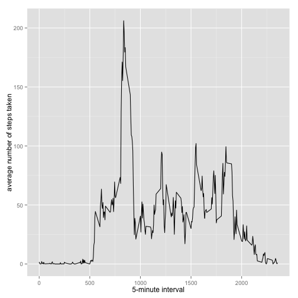

# Reproducible Research: Peer Assessment 1


## Loading and Processing the Data
##### 1. Load the Libraries and Data

```r
library(ggplot2)
library(scales)
library(Hmisc)

if(!file.exists('activity.csv')){
    unzip('activity.zip')
}
activityData <- read.csv('activity.csv')
```
##### 2. Process / Transform the Data for Analysis

```r
#activityData$interval <- strptime(gsub("([0-9]{1,2})([0-9]{2})", "\\1:\\2", activityData$interval), format='%H:%M')
```

-----

## Mean Total Number of Steps Taken Per Day

```r
stepsByDay <- tapply(activityData$steps, activityData$date, sum, na.rm=TRUE)
```

##### 1. Histogram of the Total Number of Steps Taken Each Day

```r
qplot(stepsByDay, xlab='Total steps per day', ylab='Frequency using binwith 500', binwidth=500)
```

 

##### 2. Calculate and Report the Mean and Median Total Number of Steps Taken Per Day

```r
stepsByDayMean <- mean(stepsByDay)
stepsByDayMedian <- median(stepsByDay)
```
* Mean: 9354.2295
* Median:  10395

-----

## Average Daily Activity Pattern

```r
averageStepsPerTimeBlock <- aggregate(x=list(meanSteps=activityData$steps), by=list(interval=activityData$interval), FUN=mean, na.rm=TRUE)
```

##### 1. Make a Time Series Plot

```r
ggplot(data=averageStepsPerTimeBlock, aes(x=interval, y=meanSteps)) +
    geom_line() +
    xlab("5-minute interval") +
    ylab("average number of steps taken") 
```

 

##### 2. Which 5-minute interval, on average across all the days in the dataset, contains the maximum number of steps?

```r
mostSteps <- which.max(averageStepsPerTimeBlock$meanSteps)
timeMostSteps <-  gsub("([0-9]{1,2})([0-9]{2})", "\\1:\\2", averageStepsPerTimeBlock[mostSteps,'interval'])
```

* Most Steps at: 8:35

----

## Input Missing Values
##### 1. Calculate and Report the Total Number of Missing Values in Dataset 

```r
numMissingValues <- length(which(is.na(activityData$steps)))
```

* Number of missing values: 2304

##### 2. Devise a Strategy for Filling in the Missing Values in the Dataset

##### 3. Create a New Dataset That is Equal to the Original Dataset but with the Missing Data Filled in

```r
activityDataImputed <- activityData
activityDataImputed$steps <- impute(activityData$steps, fun=mean)
```


##### 4. Make a Histogram of the Total Number of Steps Taken Each Day 


```r
stepsByDayImputed <- tapply(activityDataImputed$steps, activityDataImputed$date, sum)
qplot(stepsByDayImputed, xlab='Total steps per day (Imputed)', ylab='Frequency using binwith 500', binwidth=500)
```

 

##### Calculate and Report the Mean and Median Total Number of Steps Taken Per Day

```r
stepsByDayMeanImputed <- mean(stepsByDayImputed)
stepsByDayMedianImputed <- median(stepsByDayImputed)
```
* Mean (Imputed): 1.0766 &times; 10<sup>4</sup>
* Median (Imputed):  1.0766 &times; 10<sup>4</sup>


----

## Are There Differences in Activity Patterns Between Weekdays and Weekends?
##### 1. Create a New Factor Variable in the Dataset with Two Levels – “Weekday” and “Weekend” Indicating Whether a Given Date is a Weekday or Weekend Day


```r
activityDataImputed$dateType <-  ifelse(as.POSIXlt(activityDataImputed$date)$wday %in% c(0,6), 'weekend', 'weekday')
```

##### 2. Make a Panel Plot Containing a Time Series Plot


```r
averagedActivityDataImputed <- aggregate(steps ~ interval + dateType, data=activityDataImputed, mean)
ggplot(averagedActivityDataImputed, aes(interval, steps)) + 
    geom_line() + 
    facet_grid(dateType ~ .) +
    xlab("5-minute interval") + 
    ylab("avarage number of steps")
```

 

